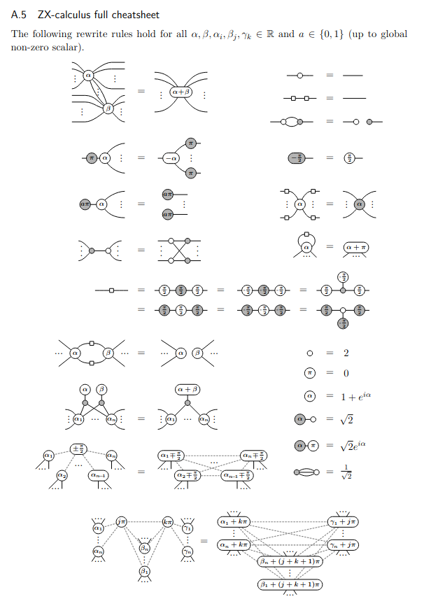

### ZX-calculus rules implementation in LMNtal

- currently, only part of them are implemented.

#### examples

- cnot3.lmn: CNOT gate x 3
- ghz.lmn: GHZ state preparation
- pauli.lmn: Pauli gates
- qft2.lmn: 2-qubit QFT
- teleport.lmn: Quantum teleportation
